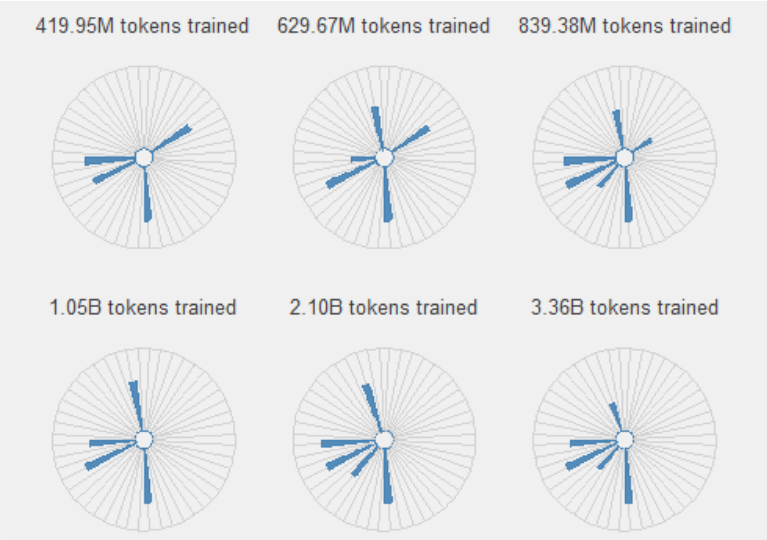
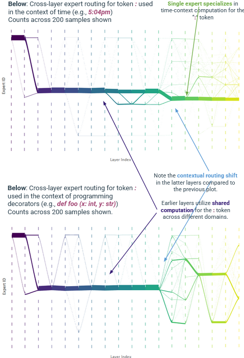
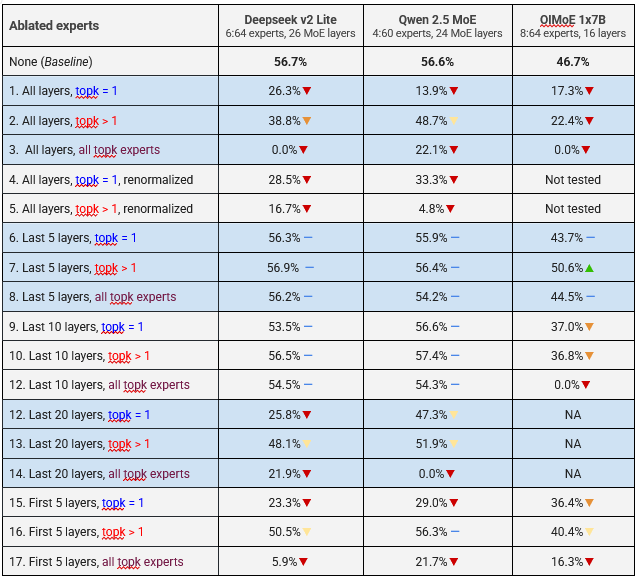
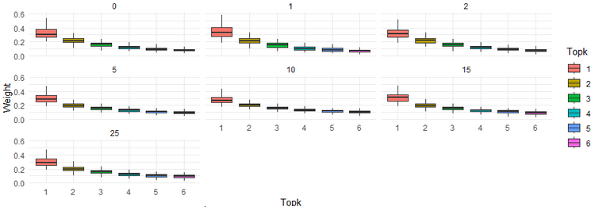

## About
This contains code for visualizations and intepretability analyses linked to the [interpretable-moes](https://github.com/bongohead/interpretable-moes) project.

The folder `analysis` contains all code for visualizations/interpretability.

## Setup
Before running analysis code, run through the following setup:

1. First, clone this repo: `git clone https://github.com/bongohead/interpretable-moes-analysis`.
2. On unix, run `sh install_packages.sh` and `sh unix_setup_paths.sh` to setup the Python environment. On Windows, run `windows_install_packages.ps1` and `windows_setup_paths.ps1`.
3. The `datasets` directory contains subdirectories with data re-used across multiple analyses. Some require additional setup.
    - `contextual-tokens`: A directory of YAML files containing text samples.
        - Each file corresponds to a single polysemantic token with 3 meanings. The file will contain a set of text samples corresponding to each of those 3 meanings. 
        - These are useful for a variety of tasks to understand contextual versus token-ID-based routing.
        - **Setup**: No additional ssetup needed.
    - `tokenizer-vocab`: A directory of CSVs containing tokenizer mappings of token IDs to vocabulary here.
        - **Setup**: these are not committed to Git, so you will need to create them as needed. Run `helpers/export_vocab_as_csv` for any tokenizers you need in your analyses.
    - `saved-models`: A directory of pytorch saved models.
        - **Setup**: Place any saved pytorch models for various analyses here.

## Analysis Direcotires
1. `analysis/activations-through-time` contains code to analyze and understand expert routing distributions through time.

 <em>Expert distributions through training</em>

2. `analysis/cross-layer-routing` contains code to visualize the routing flow of polysemantic tokens across the cross-layer architecture.

 <em>Cross-layer routing patterns</em>

3. `analysis/mmlu-ablation-tests` contains code to analyze the performance several pretrained MoE models (Qwen2-MoE, OlMoE, Deepseek V2 Lite) on MMLU. These are to test expert specialization by analyzing the impact on MMLU scores of layer-specific expert ablation tests and logit lens. This folder also contains routing visualization code for pretrained models, split across both MMLU subjects and polysemantic tokens.

 <em>MMLU ablation tests</em>

 <em>Topk distribution by layer</em>

4. `analysis/path-analysis` contains code to test different routing *paths* of models and understand path semantic correlations.