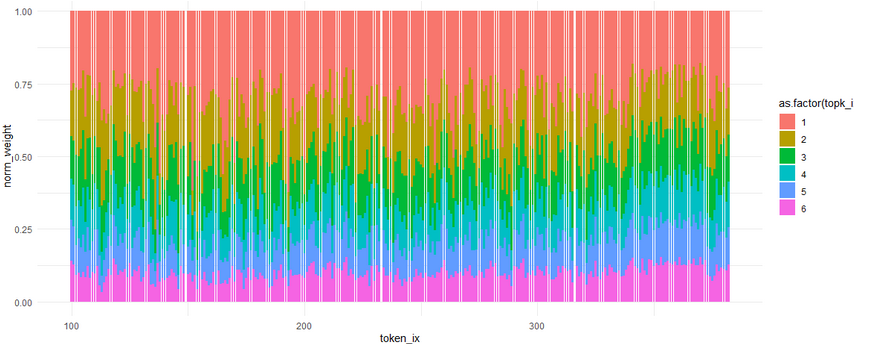

## About
This directory contains code to analyze the performance several pretrained MoE models (Qwen2-MoE, OlMoE, Deepseek V2 Lite) on MMLU. These are to test expert specialization by analyzing the impact on MMLU scores of layer-specific expert ablation tests and logit lens. This folder also contains routing visualization code for pretrained models, split across both MMLU subjects and polysemantic tokens.

## Usage
- Files `mmlu-tests-*.ipynb` contain ablation testing + logit lens code for Deepseek v2 Lite, Qwen 1.5 MoE, and OlMoE. Run these to get stats with ablated experts at a layer/topk specific level. 

 <em>MMLU ablation tests</em>

- Running the notebooks will also export several CSVs with activations from the MMLU tests. These can be used in the file `visualize_mmlu_specialization.r` to generate routing graphs at a domain/subject level (or other levels) and visualize topk counts by token index or layer.

 <em>Topk distribution by layer</em>

 <em>Topk distribution by token IX</em>

- These will also export `contextual_token_activations.csv` files which can be used in file `visualize_contextual_activations.r` to generate routing graphs for polysemantic tokens, similar to the `analysis/cross-layer-routing/visualize-routing.r` files (but for pretraiend models).