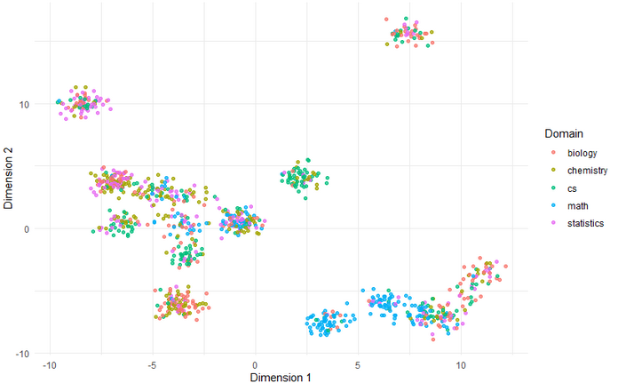

## About
This directory contains code to analyze the performance of various pretrained MoE models (Qwen2-MoE, OlMoE, Deepseek V2 Lite) on MMLU, split by various domains. The goal is to understand whether routes correlate to specific domains, and how routes behave more generally in a controlled environment on a single token with different context.

## Usage
- Run `run-mmlu.ipynb` and select a pretrained model to generate a sample of MMLU question input/outputs and the expert ids + weights associated with each. By default, only the activations linked to the last token of each sample will be exported, as these correspond to the MMLU question answer.
- Run `anayze-mmlu.r` for analysis and visualizations. It includes path grouping, routing visualizations, analysis of domain coverage by path, and JS distance metrics calculations. The goal is to better understand whether there's domain-level correlation at either an expert or path level.

 <em>UMAP embeddings of l1 - l16 routing paths with Hamming distance</em>

 <em>Routing of math versus non-math MMLU problems</em>

 <em>Percent of each l1-l10 path assigned to each MMLU domain</em>
